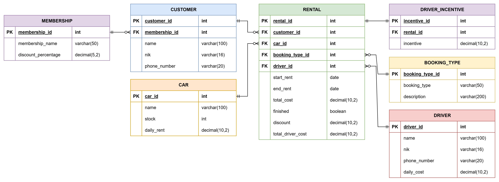

# Car Rental API V2

A RESTful API for a car rental management system built with Go, Gin, and PostgreSQL, enhanced with membership discounts, booking types, driver management, and driver incentives.

## Features

- **Customer Management**: CRUD operations for managing customer data with optional membership assignment.
- **Car Management**: CRUD operations for cars with stock management.
- **Rental Management**: CRUD operations for rentals with automatic cost calculation, membership discounts, and driver costs.
- **Membership Management**: Manage membership tiers (e.g., Bronze, Silver, Gold) with discount percentages.
- **Booking Type Management**: Support for "Car Only" and "Car & Driver" booking types.
- **Driver Management**: CRUD operations for driver data with daily cost tracking.
- **Driver Incentives**: Automatic calculation of driver incentives (5% of rental cost) for "Car & Driver" bookings.
- **Stock Management**: Automatically reduces/increases car stock on rental creation or completion.
- **Data Validation**: Ensures NIK uniqueness for customers and drivers, checks car availability, and validates booking types.
- **Relational Data**: Preloads customer, car, booking type, and driver data in rental responses.

## Tech Stack

- **Language**: Go 1.21+
- **Framework**: Gin
- **Database**: PostgreSQL
- **ORM**: GORM
- **Environment**: godotenv

## API Endpoints

### Customers
- `POST /api/v1/customers` - Create a new customer
- `GET /api/v1/customers` - Retrieve all customers
- `GET /api/v1/customers/:id` - Retrieve a customer by ID
- `PUT /api/v1/customers/:id` - Update a customer by ID
- `DELETE /api/v1/customers/:id` - Delete a customer by ID

### Cars
- `POST /api/v1/cars` - Create a new car
- `GET /api/v1/cars` - Retrieve all cars
- `GET /api/v1/cars/:id` - Retrieve a car by ID
- `PUT /api/v1/cars/:id` - Update a car by ID
- `DELETE /api/v1/cars/:id` - Delete a car by ID
- `GET /api/v1/cars/available` - Retrieve cars with stock > 0

### Rentals
- `POST /api/v1/rentals` - Create a new rental with membership discount and driver cost (if applicable)
- `GET /api/v1/rentals` - Retrieve all rentals
- `GET /api/v1/rentals/:id` - Retrieve a rental by ID
- `PUT /api/v1/rentals/:id` - Update a rental by ID
- `DELETE /api/v1/rentals/:id` - Delete a rental by ID
- `GET /api/v1/rentals/active` - Retrieve active rentals (not finished)

### Memberships
- `POST /api/v1/memberships` - Create a new membership
- `GET /api/v1/memberships` - Retrieve all memberships
- `GET /api/v1/memberships/:id` - Retrieve a membership by ID
- `PUT /api/v1/memberships/:id` - Update a membership by ID
- `DELETE /api/v1/memberships/:id` - Delete a membership by ID

### Booking Types
- `POST /api/v1/booking-types` - Create a new booking type
- `GET /api/v1/booking-types` - Retrieve all booking types
- `GET /api/v1/booking-types/:id` - Retrieve a booking type by ID
- `PUT /api/v1/booking-types/:id` - Update a booking type by ID
- `DELETE /api/v

1/booking-types/:id` - Delete a booking type by ID

### Drivers
- `POST /api/v1/drivers` - Create a new driver
- `GET /api/v1/drivers` - Retrieve all drivers
- `GET /api/v1/drivers/:id` - Retrieve a driver by ID
- `PUT /api/v1/drivers/:id` - Update a driver by ID
- `DELETE /api/v1/drivers/:id` - Delete a driver by ID

### Driver Incentives
- `POST /api/v1/driver-incentives` - Create a new driver incentive for a rental
- `GET /api/v1/driver-incentives` - Retrieve all driver incentives
- `GET /api/v1/driver-incentives/:id` - Retrieve a driver incentive by ID
- `PUT /api/v1/driver-incentives/:id` - Update a driver incentive by ID
- `DELETE /api/v1/driver-incentives/:id` - Delete a driver incentive by ID

## Installation

1. Clone the repository:
   ```bash
   git clone <repository-url>
   cd car-rental-api
   ```

2. Install dependencies:
   ```bash
   go mod download
   ```

3. Set up the PostgreSQL database:
   ```bash
   psql -U postgres -f migrations/001_create_tables.sql
   psql -U postgres -f migrations/002_add_v2_features.sql
   ```

4. Create and configure the `.env` file:
   ```bash
   cp .env.example .env
   ```
   Edit `.env` with your database credentials and other settings.

5. Run the application:
   ```bash
   go run main.go
   ```

## Environment Variables

```env
DB_HOST=localhost
DB_PORT=5432
DB_USER=postgres
DB_PASSWORD=your_password
DB_NAME=car_rental_db
DB_SSLMODE=disable
PORT=8080
```

## Database Schema


## Testing

Use the provided `test_api.http` file with the VS Code REST Client extension or import the endpoints into Postman for testing.