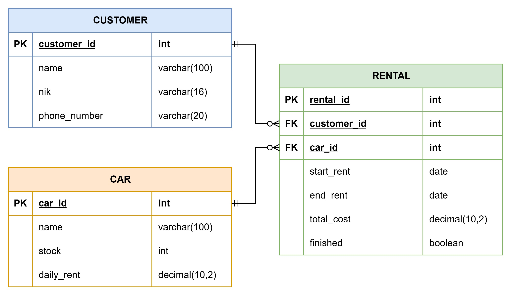

# Car Rental API

A RESTful API for a car rental management system built with Go, Gin, and PostgreSQL.

## Features

- **Customer Management**: CRUD operations for managing customer data.
- **Car Management**: CRUD operations for cars with stock management.
- **Rental Management**: CRUD operations for rentals with automatic cost calculation.
- **Stock Management**: Automatically reduces/increases car stock on rental creation or completion.
- **Data Validation**: Ensures NIK uniqueness and checks car availability.
- **Relational Data**: Preloads customer and car data in rental responses.

## Tech Stack

- **Language**: Go 1.21+
- **Framework**: Gin
- **Database**: PostgreSQL
- **ORM**: GORM
- **Environment**: godotenv

## API Endpoints

### Customers
- `POST /api/v1/customers` - Create a new customer
- `GET /api/v1/customers` - Retrieve all customers
- `GET /api/v1/customers/:id` - Retrieve a customer by ID
- `PUT /api/v1/customers/:id` - Update a customer by ID
- `DELETE /api/v1/customers/:id` - Delete a customer by ID

### Cars
- `POST /api/v1/cars` - Create a new car
- `GET /api/v1/cars` - Retrieve all cars
- `GET /api/v1/cars/:id` - Retrieve a car by ID
- `PUT /api/v1/cars/:id` - Update a car by ID
- `DELETE /api/v1/cars/:id` - Delete a car by ID
- `GET /api/v1/cars/available` - Retrieve cars with stock > 0

### Rentals
- `POST /api/v1/rentals` - Create a new rental
- `GET /api/v1/rentals` - Retrieve all rentals
- `GET /api/v1/rentals/:id` - Retrieve a rental by ID
- `PUT /api/v1/rentals/:id` - Update a rental by ID
- `DELETE /api/v1/rentals/:id` - Delete a rental by ID
- `GET /api/v1/rentals/active` - Retrieve active rentals (not finished)

## Installation

1. Clone the repository:
   ```bash
   git clone <repository-url>
   cd car-rental-api
   ```

2. Install dependencies:
   ```bash
   go mod download
   ```

3. Set up the PostgreSQL database:
   ```bash
   psql -U postgres -f scripts/setup_db.sql
   ```

4. Insert dummy data (optional):
   ```bash
   psql -U postgres -d car_rental_db -f scripts/dummy_data.sql
   ```

5. Create and configure the `.env` file:
   ```bash
   cp .env.example .env
   ```
   Edit `.env` with your database credentials and other settings.

6. Run the application:
   ```bash
   go run cmd/server/main.go
   ```

## Environment Variables

```env
DB_HOST=localhost
DB_PORT=5432
DB_USER=postgres
DB_PASSWORD=your_password
DB_NAME=car_rental_db
DB_SSLMODE=disable
PORT=8080
```

## Database Schema


## Testing

Use the provided `test_api.http` file with the VS Code REST Client extension or import the endpoints into Postman for testing.